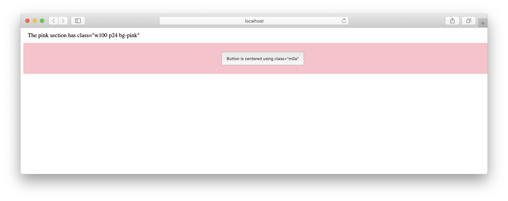

# Edge CSS

Intuitive margin and padding classes for quick markup styling

```html

<header class="mt12">Header has a margin-top of 12px</header>

<header class="mt12 mb6">Header has a margin-top of 12px and margin-bottom of 6px</header>
```

## Smart

Based on the Duodecimal System which is a positional system using twelve as its base (a.k.a. `Base-12`). [Bootstrap](https://getbootstrap.com/), [Skeleton](http://getskeleton.com/), and [960 Grid System](https://960.gs/) are all designed using `Base-12` principles. All modern iOS and Android displays are also based on Base 12 and are divisible by 12 or it's four divisors: 2, 3, 4, 6.

## Install

```shell
yarn add @flavioespinoza/edge-css
```

## Usage

```scss
// Import edge.css into your .scss or .less file
@import 'source/edge.css'
```

or

```html
<!-- Copy edge.css into your static styles css folder and include in the head of your index.html -->
<head>
    <link rel="stylesheet" href="/static/styles/edge.css" />
</head>
```

Add classes to create padding and margins with the following `(px) values`: 2, 3, 4, 6, 12, 16, 18, 24, 36, 48

```html
<body>
    <header class="mt12">Header has a margin-top of 12px</header>
</body>
```

These elements have no padding

```html
<body>
    <h1 class="p0">Lorem ipsum</h1>
    <h2 class="p0">Dolor sit</h2>
</body>
```

This navigation is centered

```html
<body>
    <!-- Read "{ margin: auto 0 }" -->
    <nav class="m0a">
        <a href="/">Home</a>
    </nav>
</body>
```

### Important Override
All `edge-css` properties have `!important` so they will override any class that is specified before them:

```css
.mr6 {
    margin-right: 6px !important;
}
```

Consider the following button class:
```css
.btn-default {
    margin: 12px;
}
```

Adding `btn-default` to a button adds the following styles:
- margin-top: 12px;
- margin-left: 12px;
- margin-bottom: 12px;
- margin-right: 12px;

```html
<button class="btn-default">Submit</button>
```


Adding the `edge-css` class `mr6` after `btn-default` changes the style to:
- margin-top: 12px;
- margin-left: 12px;
- margin-bottom: 12px;
- `margin-right: 6px !important;`

```html
<button class="btn-default mr6">Submit</button>
```

## Syntax
All `edge-css` classes are comprised of simple aliases:
- Property (margin or padding)
- Position (top, bottom, right, left)
- Direction (positive or negative -> margins only)
- Size (px)

### Property

```shell
m         margin
p         padding
```

### Position

```shell
t         top
b         bottom
r         right
l         left

v         top & bottom
h         left & right

{none}    No Position specified means "all" positions (see example below)
```

Button with position `{none}` and margin size of `12px`
```html
<button class="m12">Submit</button>    

<!-- 
    margin-top: 12px !important; 
    margin-right: 12px !important; 
    margin-left: 12px !important; 
    margin-bottom: 12px !important;
-->
```

### Direction (positive or negative - margins only)

```html
<button class="mr16">Submit</button>    <!-- margin-right: 16px !important; -->

<button class="mr-16">Submit</button>   <!-- margin-right: -16px !important; -->
```

### Size

```shell
a   auto
0   0px
2   2px
4   4px
6   6px
8   8px
12  12px
16  16px
18  18px
24  24px
32  32px
48  48px
```

Button with padding size of `12px`
```html
<button class="p12">Submit</button>
```

Div with margin size `24px` and various positions
```html

<!--margins-->
<div class="m24">margin: 24px</div>
<div class="mt24">margin-top: 24px</div>
<div class="mr24">margin-right: 24px</div>
<div class="mb24">margin-bottom: 24px</div>
<div class="ml24">margin-left: 24px</div>
<div class="mh24">margin-left: 24px; margin-right: 24px</div>
<div class="mv24">margin-top: 24px; margin-bottom: 24px</div>

<!--negative margins-->
<div class="m-24">margin: -24px</div>
<div class="mt-24">margin-top: -24px</div>
<div class="mr-24">margin-right: -24px</div>
<div class="mb-24">margin-bottom: -24px</div>
<div class="ml-24">margin-left: -24px</div>

<!--horizontal & vertical margins-->
<div class="mh-24">margin-left: -24px; margin-right: -24px</div>
<div class="mv-24">margin-top: -24px; margin-bottom: -24px</div>
```

## Auto Margins

```html
<!--button will be centered inside the section-->
<body>
    <section class="w100 p24 bg-pink">
        <button class="m0a">Button is centered using class="m0a"</button>
    </section>
</body>

```


## Development

Clone the repo.
```shell
git clone https://github.com/flavioespinoza/edge-css.git
```

CD into your local `edge-css` directory and install the dependencies.
-   [sass] - Sass is the most mature, stable, and powerful professional grade CSS extension language in the world.
-   [gulp] - The automated task/build runner for development.

```shell
yarn install
```

Run the build command and modify the `.scss` files in the `./source` directory and `gulp` will automatically update your `edge.css` file in the `./source` directory.
```shell
yarn build
```


[sass]: http://sass-lang.com/install
[gulp]: https://github.com/gulpjs/gulp/blob/master/docs/getting-started.md
